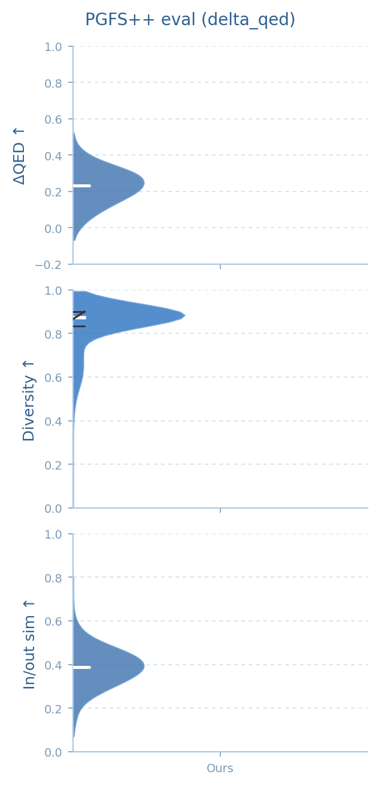

# PGFS++

**Molecular Improvement Ensuring Synthetic Accessibility under Diversity Constraints**

[](LICENSE)
[](https://www.python.org/)
[](https://pytorch.org/)

**PGFS++** extends PGFS and achieves competitive performance against leading synthesis-aware molecular optimization methods.

<p align="center">
  
</p>

<p align="center">
  <em>PGFS++ consistently improves PGFS and its variants.</em>
</p>

---

## What is included

| Path | Contents |
|------|----------|
| `src/` | Hierarchical PPO trainer, reaction environment, rewards |
| `configs/` | Paper configs (`delta_qed_*`, `delta_seh_*`) and a smoke config |
| `data/` | Train pool, 2k test set, templates, precomputed T→R2 masks |
| `scoring/seh/` | Bengio et al. (2021) sEH proxy weights |
| `eval/` | Greedy eval launchers for the 2k test set |

Paper checkpoints (~91 MB each) are downloaded separately for evaluation.

---

## Installation

Tested on Ubuntu with an NVIDIA GPU, CUDA 12.1, PyTorch 2.3.0, and RDKit 2023.9.6 from conda-forge.

```bash
git clone https://github.com/bz317/PGFS_plus_plus.git
cd PGFS_plus_plus

conda env create -f conda_env_pgfspp.yml
conda activate pgfspp
bash scripts/bootstrap_pgfspp_cuda121.sh
pip install -e . --no-deps
```

`--no-deps` keeps the conda / CUDA wheels already installed by the bootstrap script. Use `SKIP_PYG=1 bash scripts/bootstrap_pgfspp_cuda121.sh` for a ΔQED-only setup; ΔSEH needs PyTorch Geometric.

**Check the install** (loads shipped data, parses a molecule, reports CUDA):

```bash
conda activate pgfspp
python scripts/check_install.py
```

You should see `PGFS++ install check passed.`

---

## Quick start: smoke training

Run one short ΔQED PPO update on the real data files. This is the fastest way to confirm that training can start; it is **not** a paper result.

```bash
conda activate pgfspp
bash scripts/run_smoke.sh
```

The smoke config (`configs/smoke_delta_qed.yaml`) uses 64 environment steps, one PPO epoch, and an 8-molecule greedy eval. On a single A100 it finishes in well under a minute and writes `runs/<id>/final_model.pt`. RDKit kekulize warnings during rollouts are expected and can be ignored.

Weights & Biases is optional. Training defaults to offline (`WANDB_MODE=disabled`) unless you set `WANDB_API_KEY`.

---

## Training

All commands below are run from the repository root with `conda activate pgfspp`.

Paper configs use a 4-step reaction budget, 1M environment steps, and an input–output similarity bonus (multiplicative in `*_scale.yaml`, additive in `*_weights.yaml`).

```bash
bash run_train.sh configs/delta_qed_scale.yaml
bash run_train.sh configs/delta_seh_scale.yaml
```

The other paper configs are `configs/delta_qed_weights.yaml` and `configs/delta_seh_weights.yaml`.

Equivalent entrypoint:

```bash
PYTHONPATH=. python -m src.scripts.run_experiment --config configs/delta_qed_scale.yaml
```

Checkpoints are written to `runs/<run-id>/`. To log to W&B:

```bash
export WANDB_MODE=online
export WANDB_API_KEY=...
export WANDB_ENTITY=...
bash run_train.sh configs/delta_qed_scale.yaml
```

The T→R2 mask cache is already in `data/r2_valid_indices.npz`. Rebuild it only if you change the reactant pool or templates:

```bash
bash preprocessing/run_precompute_r2_valid_indices.sh
```

---

## Evaluation

Greedy rollouts on the fixed 2k test set (`data/reactants_test.pkl`). Download the paper checkpoints first, then run:

| Run ID | Reward | Checkpoint |
|--------|--------|------------|
| `ymhrz9yg` | ΔQED scale | `runs/ymhrz9yg/model_step_1001472.pt` |
| `ncs94oq8` | ΔSEH scale | `runs/ncs94oq8/model_step_1001472.pt` |

```bash
bash scripts/download_checkpoints.sh
bash eval/run_eval_delta_qed_scale.sh
bash eval/run_eval_delta_seh_scale.sh
```

Inference writes these files under `results/` (the directory is created if it is missing):

```
results/4s_delta_qed_ymhrz9yg_1m_compact_results.txt
results/4s_delta_qed_ymhrz9yg_1m_compact_results.summary.json
results/4s_delta_seh_ncs94oq8_1m_compact_results.txt
results/4s_delta_seh_ncs94oq8_1m_compact_results.summary.json
```

Optional panels from those logs:

```bash
bash eval/run_plot_delta_qed_scale.sh
bash eval/run_plot_delta_seh_scale.sh
```

Eval + plot together:

```bash
bash eval/run_all_compact.sh
```

---

## Citation

```bibtex
@inproceedings{pgfspp2026,
  title     = {PGFS++: Molecular Improvement Ensuring Synthetic Accessibility under Diversity Constraints},
  author    = {Zhang, Boqiao},
  year      = {2026}
}
```

---

## License

This project is released under the [MIT License](LICENSE).
The sEH proxy under `scoring/seh/` follows Bengio et al., *Flow Network based Generative Models for Non-Iterative Diverse Candidate Generation* (NeurIPS 2021).
